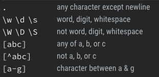

## Define
	- Tìm kiểu chuỗi theo 1 pattern nào đó!

## Note: 
- Trong // là character cần matches
- Có 1 vài ký tự đặt biệt như dấu . ( chấm )
- Nếu muốn matches các ký tự đó thì cần thêm `escaped character`  (\)
	+ eg: /\./g --> find dot character

## Character class:
[EG](regexr.com/5d2g1)
- Tương tự hiểu theo cách bên trong cặp ngoặc vuông [] : sẽ là list các ký tự sẽ được tìm mà matches -> kế tiếp nếu muốn valid đúng theo pattern thì lại thêm 1 list các phần từ bên trong [] tiếp theo có thể xảy ra 
eg: [abc][0-9]+ -> ký tự vị trí đầu phải là 1 trong a,b,c -> ký tự vị trí thứ 2 phải à từ 0 > 9 và dấu (+) tượng trưng cho việc sẽ matches những ký tự còn lại theo pattern ở trước tức là pattern[1234567890] 

[Detected](regexr.com/5d2gd) : select từ theo đúng vị trí

## Anchors
- ^ : caret
- $ : dollar sign
- \b: word boundary
- Start and end the same vimeditor : ^...$
eg: 
+ /\bdog\b/.test('this is a dog') 
+ /\bdog\b/.test('this is a doggy')

## Quantifiers : định lượng
- ? : có hay không cũng được target là pattern ở trước
- {}: {start, end}
- * : ~~ select all

## Flags
- g
- gi: case insensitive
- gim : multiline
